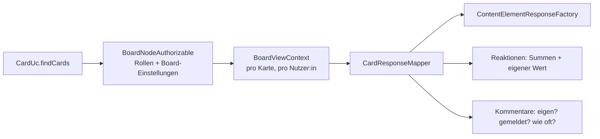
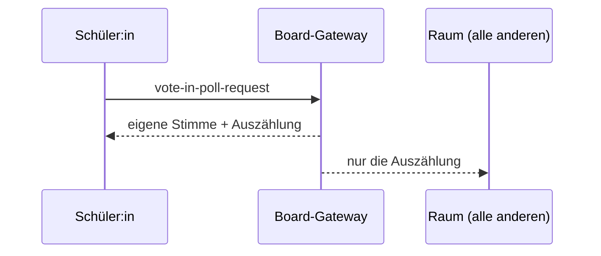

# Interaktive Board-Elemente

Padlet-inspirierte Erweiterungen der Spalten-Boards: Karten lassen sich beantworten, bewerten
und kommentieren, und es gibt fünf neue Element-Typen für Dinge, die vorher nur als Behelf im
RichText möglich waren.

Alles sitzt hinter einem gemeinsamen Schalter:

```
FEATURE_COLUMN_BOARD_INTERACTIVE_ELEMENTS_ENABLED   # Default: false
```

Der Server-Anteil liegt in diesem Repo unter `apps/server/src/modules/board`, der Client-Anteil
im Nachbar-Repo `nuxt-client`; beide auf dem Branch `feat/padlet-inspired-elements`.

## Was dazugekommen ist

| | Ort | Zustand pro Nutzer:in |
|---|---|---|
| **Umfrage** | Element | ja — eigene Stimme, anonym oder offen |
| **Reaktionen** | Karte | ja — eigener Wert, Summen für alle |
| **Kommentare** | Karte | ja — eigener Kommentar, eigene Meldung |
| **Termin** | Element | nein |
| **Code** | Element | nein |
| **Formel (LaTeX)** | Element | nein |
| **Checkliste** | Element | nein — geteilter Fortschritt |
| **Sprach-/Videoaufnahme** | Element | nein |

Reaktionen und Kommentare hängen an der **Karte**, nicht am Element: eine Karte ist die Einheit,
auf die man in einem Board antwortet. Beide sind Board-Einstellungen und stehen im Board-Menü
unter „Reaktionen und Kommentare".

## Das tragende Muster: BoardViewContext

Bis hierher sah eine Element-Antwort für alle gleich aus. Mit Umfrage, Reaktionen und
Kommentaren stimmt das nicht mehr — dieselbe Karte muss für verschiedene Leute Verschiedenes
sagen. Deshalb wird jede Karten- und Element-Antwort **für genau eine lesende Person** gebaut:

```ts
interface BoardViewContext {
	userId?: EntityId;
	canEdit?: boolean;
	reactionType?: CardReactionType;
	commentsEnabled?: boolean;
	canModerate?: boolean;
	authorNames?: Map<EntityId, string>;
}
```

Fehlt der Kontext, heißt das „kein persönlicher Zustand, keine Ergebnisse" — die sichere Lesart
für die geteilten Payloads, die an einen ganzen Board-Raum gehen.



`findCards` löst dabei die Namen aller Kommentar-Autor:innen **einmal pro Kartenstapel** auf, nicht
pro Kommentar; `UserService.getDisplayName` berücksichtigt geschützte Rollen.

## Berechtigungen

Der springende Punkt: **Antworten ist eine Lese-, keine Schreibberechtigung.** Wer ein Board nur
sehen darf, ist genau die Person, die darauf abstimmen, reagieren, kommentieren und Haken setzen
können soll. Deshalb hat jede dieser Aktionen eine eigene Operation in `BoardNodeRule`, statt
über `updateElement` zu laufen:

| Operation | Regel | Bedeutet |
|---|---|---|
| `voteInPoll` | `_canViewBoard` | abstimmen |
| `reactToCard` | `_canViewBoard` | reagieren |
| `commentOnCard` | `_canViewBoard` | kommentieren, eigenen Kommentar ändern/löschen, melden |
| `checkChecklistItem` | `_canViewBoard` | Haken setzen |
| `moderateCardComments` | `_canEditBoard` | fremde Kommentare entfernen |
| `updateBoardReactionType` | `_canManageBoard` | Reaktionsart umstellen |
| `updateBoardCommentsEnabled` | `_canManageBoard` | Kommentare an/aus |
| `updateElement` | `_canEditBoard` | Element inhaltlich ändern |

Das Feature-Flag wird zusätzlich serverseitig durchgesetzt — beim Anlegen der neuen Element-Typen
(`CardUc.createElement`) und bei den Board-Einstellungen. Ein ausgeschaltetes Flag ist damit kein
reines UI-Verstecken.

## Datenschutz-Entscheidungen

Diese drei Punkte sind absichtlich so und nicht anders:

**Anonyme Umfragen speichern keine `userId`.** Stattdessen einen HMAC über ein Salt, das pro
Element erzeugt wird. Das reicht, um eine zweite Stimme zu erkennen und Abstimmenden ihre eigene
Wahl zu zeigen, trägt aber keinen Namen — wer das Salt löscht, macht die Stimmen endgültig
unzuordenbar. Optionen oder die Anonymität zu ändern verwirft die Stimmen, weil sie danach etwas
anderes bedeuten würden; die UI sagt das vorher.

**Reaktionen nennen nie, wer reagiert hat.** Die Antwort enthält Summen und den eigenen Wert,
keine Liste. Eine Klassenkarte soll kein Protokoll darüber sein, wer wen mag. Aus demselben Grund
gibt es keine Reaktionsart „Note": eine für alle lesbare Bewertung ist eine Leistungsfrage mit
eigener Berechtigungs- und Datenschutzgeschichte.

**Meldungen bleiben zwischen Meldenden und Server.** Moderierende erfahren, *wie oft* ein
Kommentar gemeldet wurde, nie von wem — sonst wird aus einer Meldung ein Vorwurf im
Klassenzimmer. Der Meldegrund steht in der Datenbank für die, die handeln müssen.

Zurückgehaltene Ergebnisse werden **serverseitig weggelassen**, nicht clientseitig versteckt: bei
„Ergebnisse erst nach Freigabe" enthält die Antwort für Schüler:innen gar keine Zahlen.

## Umfrage



Ein Vote erzeugt **zwei** Payloads. Ein gemeinsamer würde allen im Raum die Wahl der
abstimmenden Person mitteilen — genau das, was eine anonyme Umfrage nicht darf. Der Client
übernimmt aus der Raum-Nachricht deshalb nur die Zahlen und behält seine eigene Stimme.

Ergebnis-Sichtbarkeit (`PollResultVisibility`):

- `always` — sofort für alle
- `afterVote` — sobald man selbst abgestimmt hat
- `onRelease` — erst wenn eine Lehrkraft freigibt (`resultsReleased`)

Wer die Umfrage bearbeiten darf, sieht die Auszählung immer; die Umfrage gehört ihm.

## Reaktionen

Board-weite Einstellung, weil zwei Karten, die Verschiedenes zählen, nicht vergleichbar sind:

- `none` (Default, auch für alle Boards von vorher)
- `like` — ein Klick pro Person, angezeigt wird die Anzahl
- `star` — 1–5 Sterne, angezeigt wird der Durchschnitt
- `vote` — Zustimmung/Ablehnung, angezeigt wird die Differenz

Eine Reaktion pro Person; ein zweiter Klick auf denselben Wert nimmt sie zurück. Ein Wert, der
nicht zur Board-Einstellung passt (drei Sterne auf einem Like-Board), ist ein 422 und kein still
zurechtgestutzter Like.

## Kommentare

Board-weite Einstellung, aus.

- Schreiben: `commentOnCard` (Lesezugriff genügt)
- Eigenen Kommentar ändern: nur die Autorin oder der Autor — **auch Lehrkräfte nicht**. Fremde
  Kommentare entfernen ja, umschreiben nein: jemandem unter seinem Namen Worte in den Mund zu
  legen ist schlimmer als Löschen.
- Entfernen: eigener Kommentar oder `moderateCardComments`
- Melden: alle außer der eigenen Autorenschaft; doppeltes Melden ist folgenlos, kein Fehler

Ein entfernter Kommentar bleibt als Platzhalter im Thread stehen, ohne Text. Ein Thread, in dem
Antworten plötzlich ins Leere zeigen, ist schwerer zu moderieren als einer, der sagt, dass etwas
entfernt wurde. Gezählt werden in der UI nur die lesbaren Kommentare — die Zahl sagt, wie viel
zu lesen ist, nicht wie viel gelöscht wurde.

Kommentartext ist Klartext. Markup zuzulassen hieße, dass sich über jede Karte ein Link oder ein
Bild an denen vorbeischmuggeln lässt, die das Board nicht bearbeiten dürfen.

## Die übrigen Elemente

**Termin** — Bezeichnung und optionales Datum, in der Anzeige mit Restzeit; ab zwei Tagen vorher
gelb, nach Ablauf rot. Kein Datum zu senden löscht es.

**Code** — wird **wortgetreu** gespeichert und als Text in Monospace gerendert. Die Sprache ist ein
Etikett; es wird nichts hervorgehoben und nichts ausgeführt, weshalb eine unbekannte Sprache
harmlos ist. (Ein Syntax-Highlighter würde eine neue Abhängigkeit bedeuten und ist bewusst nicht
dabei.)

**Formel** — LaTeX-Quelle, wortgetreu gespeichert, im Client mit KaTeX gerendert. KaTeX war für
das RichText-Element ohnehin schon im Projekt. Im nicht-werfenden Modus escapt es, was es nicht
parsen kann, weshalb die Ausgabe trotz nutzergeschriebener Quelle sicher eingesetzt werden kann;
beim Bearbeiten sieht man die Beschwerde des Parsers direkt.

**Checkliste** — **geteilter** Zustand: sie hält den Fortschritt der Gruppe fest, nicht den jeder
einzelnen Person. Genau das macht sie billig; eine Variante pro Person bräuchte ein eigenes
Datenmodell und eine eigene Datenschutz-Antwort. Die Liste zu bearbeiten erhält den Zustand der
Punkte, die es weiterhin gibt — einen Tippfehler zu beheben hakt nichts ab oder an. Eine Kopie
startet ohne Haken, weil sie eine frische Aufgabe ist.

**Sprach-/Videoaufnahme** — die Aufnahme ist eine gewöhnliche Datei unter dem Element im
File-Storage, genau wie der Anhang eines Datei-Elements; sie wird auf denselben Wegen kopiert und
gelöscht. Neu ist nur der Recorder (MediaRecorder-API) und der Player. Das Composable besitzt den
Stream und gibt ihn beim Stoppen, beim Abbrechen und beim Verschwinden des Elements frei —
vergessene Tracks lassen die Kamera-Leuchte an, und das verzeiht niemand. Browser ohne
MediaRecorder und verweigerte Berechtigungen sagen das, statt einen Knopf stehen zu lassen, der
nichts tut.

## Realtime

| Nachricht | Raum bekommt |
|---|---|
| `vote-in-poll-request` | nur die Auszählung |
| `react-to-card-request` | nur die Summen |
| `add/edit/remove/report-card-comment-request` | nur die Karten-ID → alle holen die Karte neu |
| `set-checklist-item-checked-request` | das ganze Element |
| `update-board-reaction-type-request` | Board-Update |
| `update-board-comments-enabled-request` | Board-Update |

Bei Kommentaren wird bewusst nachgeladen statt verteilt: wie ein Kommentar sich liest, hängt
davon ab, wer schaut — eigen, von mir gemeldet, wie oft gemeldet. Die Checkliste ist geteilter
Zustand und bedeutet für alle dasselbe, deshalb geht sie unverändert an alle.

## Tests

| Datei | Deckt ab |
|---|---|
| `controller/api-test/poll-vote.api.spec.ts` | 18 Fälle: Abstimmen ohne Editierrecht, Fremde, Anonymität, Ergebnis-Sichtbarkeit |
| `controller/api-test/card-reaction.api.spec.ts` | 14 Fälle: Reagieren, Wertebereiche, keine Namen, Board-Einstellung |
| `controller/api-test/card-comment.api.spec.ts` | 23 Fälle: Schreiben, Bearbeiten, Moderation, Melden, Sichtbarkeit der Meldezahl |
| `controller/api-test/interactive-elements.api.spec.ts` | 14 Fälle: Termin, Code, Formel, Checkliste, Aufnahme |

Client-seitig: `PollElement.unit.ts`, `CardReactionBar.unit.ts`, `CardCommentSection.unit.ts`,
`ChecklistElement.unit.ts`, `useMediaRecorder.composable.unit.ts`.

Die API-Tests brauchen das Flag; `.env.test` setzt es deshalb auf `true`.

## Demo-Daten

`ios-client/scripts/seed-demo-content.py` legt im „Wochenplan"-Board zwei zusätzliche Spalten an
und schaltet Likes und Kommentare ein:

- **Umfragen** — drei Umfragen, je eine pro Ergebnis-Modus, eine davon anonym, eine mit
  Mehrfachauswahl
- **Bausteine** — Termin (relativ zum Lauf), Checkliste, Code, Formel, leeres Aufnahme-Element

Das Skript rüstet auch Boards nach, die vor diesen Spalten geseedet wurden, und überspringt beide
Spalten, wenn das Flag aus ist — sonst wäre die Spalte eine Reihe leerer Karten.

## Was bewusst offen ist

- **Quiz / Selbsttest** aus der ursprünglichen Liste fehlt. H5P deckt das teilweise ab; ein
  eigenes Quiz mit gespeichertem Fortschritt wäre pro Person und damit ein eigenes Datenmodell.
- **Abgabe-Element** fehlt ebenfalls — fachlich der nächste Kandidat, aber es berührt den
  bestehenden Submission-Pfad und gehört nicht in diesen Schwung.
- **Karten/Standort** ist nicht dabei: didaktisch schmal, und externe Kartenkacheln sind eine
  Datenschutzfrage für sich.
