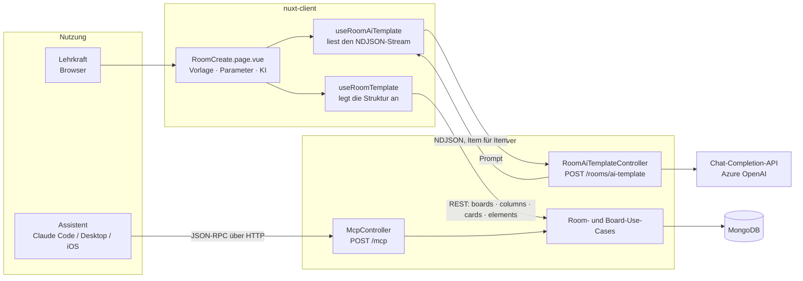
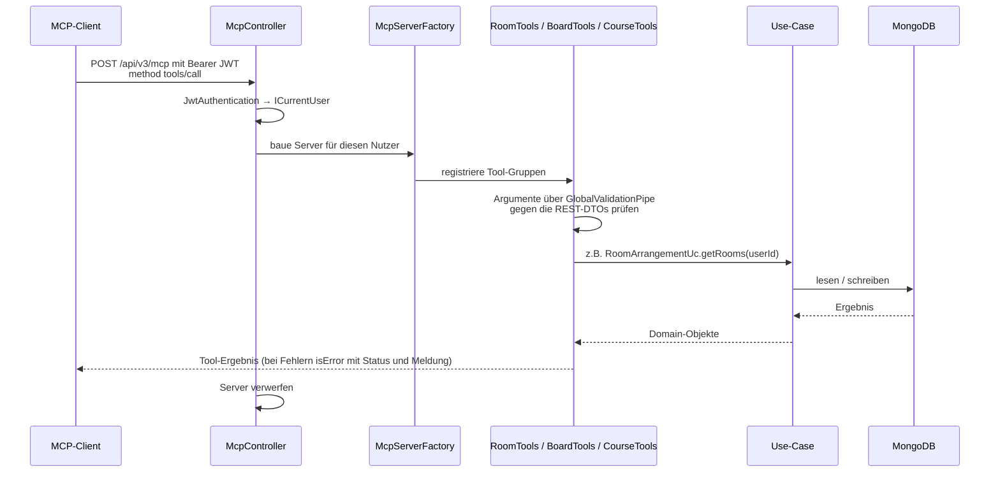
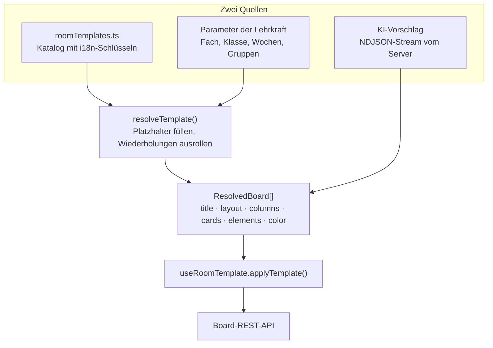
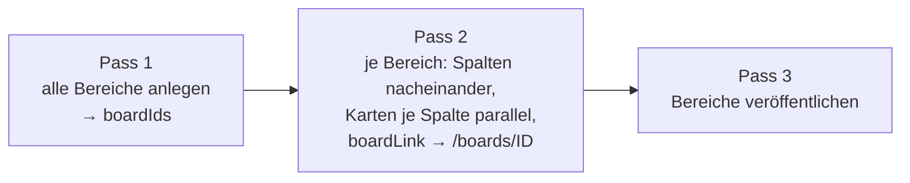
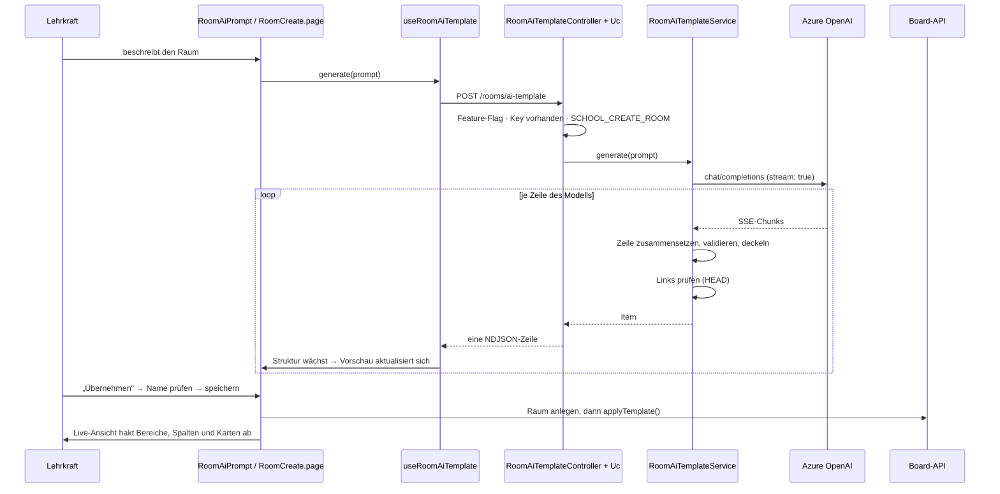
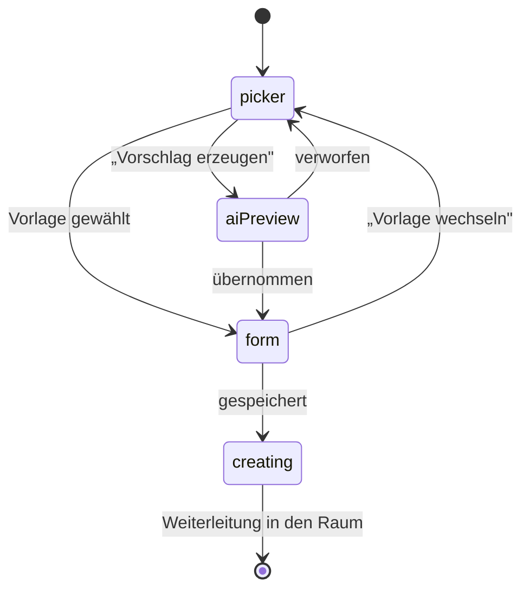

# Raumstrukturen: KI-Vorlagen und MCP

Zwei Wege führen inzwischen Struktur in einen Raum — beide enden bei denselben Board-Use-Cases:

- **Lehrkraft im Browser**: kuratierte Vorlagen mit Parametern und der KI-Modus beim Raum-Anlegen.
- **Assistent über MCP**: Claude Code, die Claude-Desktop-App oder der iOS-Assistent sprechen den
  MCP-Endpoint des Servers an.

Dieses Dokument beschreibt beide Seiten. Die Server-Anteile liegen in diesem Repo, die
Client-Anteile im Nachbar-Repo `nuxt-client`; beide auf dem Branch `feat/room-templates-ai`.
Für Details zum MCP-Toolsatz siehe zusätzlich
[`apps/server/src/modules/mcp-server/README.md`](../apps/server/src/modules/mcp-server/README.md).

## Überblick



Der Unterschied in einem Satz: **MCP ruft die Use-Cases direkt im Server auf, der Client geht über
die normale REST-API** — deshalb gelten in beiden Fällen dieselben Berechtigungen, dieselben DTOs
und dieselbe Validierung.

---

## Teil 1: MCP-Server

`POST /api/v3/mcp`, Streamable HTTP, **stateless**: Jeder Request authentifiziert sich über den
normalen `@JwtAuthentication()`-Guard, baut einen frischen `McpServer` für genau diesen Nutzer,
antwortet und räumt alles wieder ab. Kein Session-Store, keine zweite Zugangsart — es gilt der
JWT, den die Plattform ohnehin ausstellt.



### Aufbau

| Datei | Rolle |
| --- | --- |
| `api/mcp.controller.ts` | HTTP-Endpoint und Transport |
| `api/mcp-server.factory.ts` | baut den Server pro Request aus den Tool-Gruppen |
| `api/tools/room.tools.ts`, `course.tools.ts`, `board.tools.ts` | je eine Gruppe pro Domäne |
| `api/tools/tool-support.ts` | Serialisierung, DTO-Validierung, Fehler-Logging |

Damit die Tools dieselben Use-Cases nutzen können wie die Controller, exportieren
`RoomApiModule` (`RoomUc`, `RoomArrangementUc`, `RoomContentUc`) und `BoardApiModule`
(`BoardUc`, `ColumnUc`, `CardUc`, `ElementUc`) sie ausdrücklich.

### Bewusste Abweichungen von der REST-API

- **`create_board` veröffentlicht sofort.** Über REST ist ein neues Board ein Entwurf, den
  Schüler:innen gar nicht sehen — die häufigste Ursache für „das Board fehlt". `isVisible: false`
  stellt das REST-Verhalten wieder her.
- **`create_board` nimmt den ganzen Baum** (`columns → cards → elements`) in einem Aufruf, weil
  derselbe Weg über REST sechs Calls pro Karte kostet.
- **Elementtypen dort beschränkt auf `text` und `link`** — Dateien, Zeichnungen, H5P und externe
  Tools brauchen einen Upload oder einen Kontext, den das Protokoll hier nicht liefern kann.

### Autorisierung

Keine eigene Berechtigungslogik im Modul: Jedes Tool ruft den Use-Case auf, den auch der
REST-Controller aufruft, also entscheiden die Raum-, Kurs- und Board-Regeln. Ein Fallstrick, der
im Code kommentiert ist: `RoomUc.getRoomStats` sieht aus wie „die Liste der Räume", ist aber die
Schuladmin-Sicht hinter `SCHOOL_ADMINISTRATE_ROOMS` und antwortet Lehrkräften mit `403` —
`list_rooms` nutzt deshalb `RoomArrangementUc`, genau wie `GET /rooms`.

---

## Teil 2: KI-Modus und Vorlagen beim Raum-Anlegen

### Die gemeinsame Datenstruktur

Kuratierte Vorlage und KI-Vorschlag münden in dieselbe Form — `ResolvedBoard[]`. Alles, was danach
kommt, kennt den Ursprung nicht mehr.



`resolveTemplate()` macht zwei Dinge: Es füllt `{platzhalter}` über vue-i18n mit den
Parameterwerten, und es rollt Spalten oder Karten mit `repeatParam` so oft aus, wie der
Zahl-Parameter sagt — daher „eine Spalte pro Woche" und „eine Karte pro Gruppe". Innerhalb einer
Wiederholung zählt `{index}` ab 1; eine gewöhnliche Karte in einer wiederholten Spalte erbt deren
Index.

### Inhaltstypen einer Karte

| `kind` in der Struktur | Angelegt als `ContentElementType` | Inhalt beim Anlegen |
| --- | --- | --- |
| `text` | `richText` | HTML, `inputFormat: richTextCk5` |
| `link` | `link` | externe URL + Titel |
| `boardLink` | `link` | URL des Bereichs, erst nach Pass 1 auflösbar |
| `folder` | `fileFolder` | Ordnertitel |
| `drawing` | `drawing` | leer |
| `collaborative` | `collaborativeTextEditor` | leer |
| `videoConference` | `videoConference` | Titel |

Karten tragen zusätzlich eine `color` aus der `Colors`-Enum des Boards — in den Vorlagen
semantisch belegt: rot für Aufgaben, blau für Material, grün für Ergebnisse, amber für Termine.

### Anlegen in drei Durchgängen

Der Grund für die Aufteilung ist der Querverweis: Eine Karte in Bereich 1 kann erst dann auf
Bereich 3 zeigen, wenn dessen ID existiert.



Nebenbedingungen, die im Code stehen:

- Spalten müssen **nacheinander** entstehen, ihre Reihenfolge folgt der Anlegereihenfolge.
  Karten **innerhalb** einer Spalte ebenso; verschiedene Spalten laufen parallel.
- Pass 3 ist nicht optional: Ein neu erzeugtes Board ist ein Entwurf und für Mitglieder unsichtbar.
- Schlägt ein Elementtyp fehl (z.B. weil die Instanz ihn nicht anbietet), wird er übersprungen,
  ohne den Rest der Karte zu verlieren.
- Nach jedem angelegten Element meldet `createdKeys` den Fortschritt — daraus speist sich die
  Live-Ansicht beim Anlegen.

### Der KI-Weg



Die Antwort ist bewusst **NDJSON statt eines großen JSON-Objekts**: Eine abgeschlossene Zeile ist
sofort verwertbar, also kann die Vorschau mitwachsen, ohne unfertiges JSON parsen zu müssen.

### Schritte der Anlegeseite



`creating` ist kein Spinner, sondern dieselbe Strukturansicht mit Häkchen: Was schon im Raum
existiert, ist markiert, der Rest ist ausgegraut.

### Leitplanken gegen ein plauderndes Modell

| Regel | Wert | Ort |
| --- | --- | --- |
| Bereiche pro Vorschlag | max. 4 | `MAX_BOARDS` |
| Spalten pro Bereich | max. 6, per Request setzbar | `DEFAULT_MAX_COLUMNS`, `maxColumns` |
| Karten pro Spalte | max. 8 | `MAX_CARDS_PER_COLUMN` |
| Elemente pro Karte | max. 4 | `MAX_ELEMENTS_PER_CARD` |
| Titellänge / Textlänge | 100 / 2000 Zeichen | `MAX_TITLE_LENGTH`, `MAX_TEXT_LENGTH` |
| Kartenfarbe | nur Werte der `Colors`-Enum | `cardColor()` |
| Links | nur öffentliche `https`-Adressen ohne Credentials | `publicUrl()` |
| Links | einmal per `HEAD` geprüft, 404/410 fliegt raus | `doesResolve()` |
| Querverweis | nur auf Bereiche innerhalb des Vorschlags | `parseElement()` |

Die Link-Prüfung ist der teuerste Teil und über `ROOM_AI_CHECK_LINKS` abschaltbar. Sie existiert,
weil eine erfundene Referenz schlimmer ist als gar keine.

### Konfiguration

Alle Werte hängen an `RoomAiConfig` (`ROOM_AI_CONFIG_TOKEN`), registriert im `RoomApiModule`.

| Variable | Default | Bedeutung |
| --- | --- | --- |
| `FEATURE_ROOM_AI_TEMPLATE_ENABLED` | `false` | schaltet Endpoint und Client-Einstieg frei, liegt in der Public Config |
| `ROOM_AI_API_KEY` | leer | ohne Key bleibt der Modus aus, auch bei gesetztem Flag |
| `ROOM_AI_API_URL` | OpenAI `chat/completions` | Endpoint des Anbieters |
| `ROOM_AI_MODEL` | `gpt-4o-mini` | bei Azure der Deployment-Name |
| `ROOM_AI_API_STYLE` | `openai` | `azure` sendet den Key als `api-key` statt als Bearer-Token |
| `ROOM_AI_CHECK_LINKS` | `true` | vorgeschlagene Links einmal prüfen |
| `ROOM_AI_LINK_CHECK_TIMEOUT_MS` | `3000` | Zeitbudget pro Link |
| `INCOMING_REQUEST_TIMEOUT_AI_TEMPLATE` | `120000` | eigener Timeout, weil die Generierung länger schreibt als ein normaler Request dauert |

> Der Key gehört **nicht** in die getrackte `.env.development`, sondern in die gitignorierte
> `.env` daneben, die der Server per dotenv ohnehin lädt.

---

## Wo was liegt

### Server (dieses Repo)

| Pfad | Rolle |
| --- | --- |
| `apps/server/src/modules/room/api/room-ai-template.controller.ts` | Endpoint, schreibt NDJSON und setzt die Header erst beim ersten Item |
| `apps/server/src/modules/room/api/room-ai-template.uc.ts` | Feature-Flag, Key-Prüfung, `SCHOOL_CREATE_ROOM` |
| `apps/server/src/modules/room/api/service/room-ai-template.service.ts` | Prompt, Stream-Parsing, Validierung, Link-Prüfung |
| `apps/server/src/modules/room/room.config.ts` | `RoomPublicApiConfig`, `RoomConfig`, `RoomAiConfig` |
| `apps/server/src/modules/room/timeout.config.ts` | Timeout-Budget der Route |
| `apps/server/src/modules/mcp-server/**` | MCP-Endpoint, Factory, Tool-Gruppen |

### Client (Nachbar-Repo `../nuxt-client`)

| Pfad | Rolle |
| --- | --- |
| `nuxt-client/src/modules/data/room/roomTemplates/roomTemplates.ts` | Vorlagenkatalog |
| `nuxt-client/src/modules/data/room/roomTemplates/types.ts` | Vorlagen- und `Resolved*`-Typen |
| `nuxt-client/src/modules/data/room/roomTemplates/roomTemplate.resolver.ts` | Platzhalter und Wiederholungen |
| `nuxt-client/src/modules/data/room/roomTemplates/roomTemplates.composable.ts` | Anlegen in drei Durchgängen |
| `nuxt-client/src/modules/data/room/roomTemplates/roomAiTemplate.composable.ts` | NDJSON-Stream lesen |
| `nuxt-client/src/modules/feature/room/roomTemplates/*.vue` | Galerie, Parameterfelder, Strukturansicht, KI-Eingabe |
| `nuxt-client/src/modules/page/room/RoomCreate.page.vue` | die vier Schritte |

## Erweitern

**Neuer Inhaltstyp auf einer Karte** — vier Stellen:

1. `types.ts`: `kind` in `RoomTemplateElement` und `ResolvedElement` ergänzen.
2. `roomTemplates.composable.ts`: Eintrag in `ELEMENT_TYPES` und Fall in `contentOf()`.
3. `RoomTemplateStructure.vue`: Icon in `ELEMENT_ICONS`, i18n-Schlüssel
   `pages.roomCreate.templates.element.<kind>` in allen vier Sprachdateien.
4. Server: Fall in `parseElement()` und eine Zeile im Systemprompt, sonst schlägt die KI ihn nie vor.

**Neue Vorlage** — nur `roomTemplates.ts` plus Sprachdateien; ein Test prüft, dass jede Vorlage für
jeden `repeatParam` auch einen Parameter deklariert.

**Anderer KI-Anbieter** — `ROOM_AI_API_URL`, `ROOM_AI_MODEL` und `ROOM_AI_API_STYLE` setzen. Alles,
was OpenAI-kompatible `chat/completions` mit `stream: true` spricht, passt ohne Codeänderung.

## Tests

```bash
# Server
npx jest apps/server/src/modules/room/api/service     # KI-Service: Stream, Validierung, Links
npx jest apps/server/src/modules/mcp-server           # MCP inkl. echtem JSON-RPC über HTTP

# Client
cd ../nuxt-client
npx vitest run src/modules/data/room/roomTemplates    # Resolver, Anlegen, Stream
npx vitest run src/modules/page/room                  # die Schritte der Anlegeseite
```

Der KI-Service wird ohne Netz getestet: `global.fetch` liefert eine gefälschte SSE-Antwort, und die
Link-Prüfung antwortet je nach Testfall mit 200, 404, 405 oder einem Verbindungsfehler.
